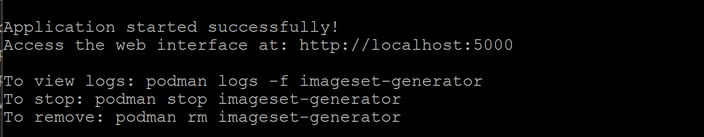
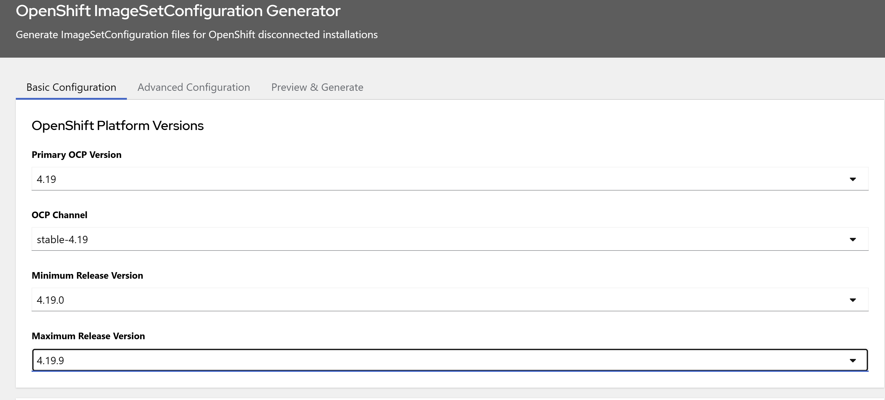
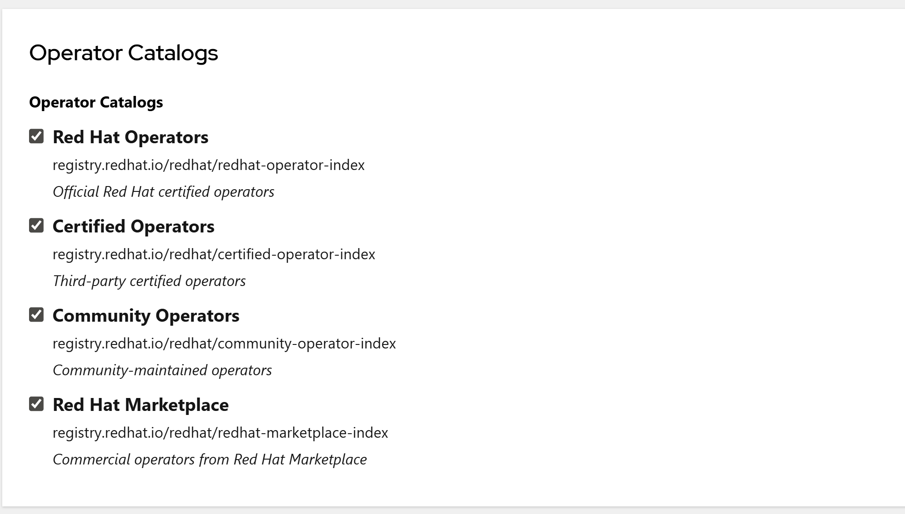
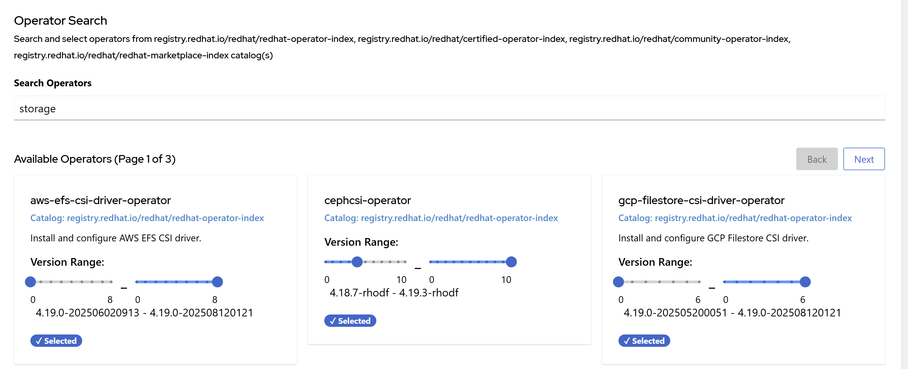
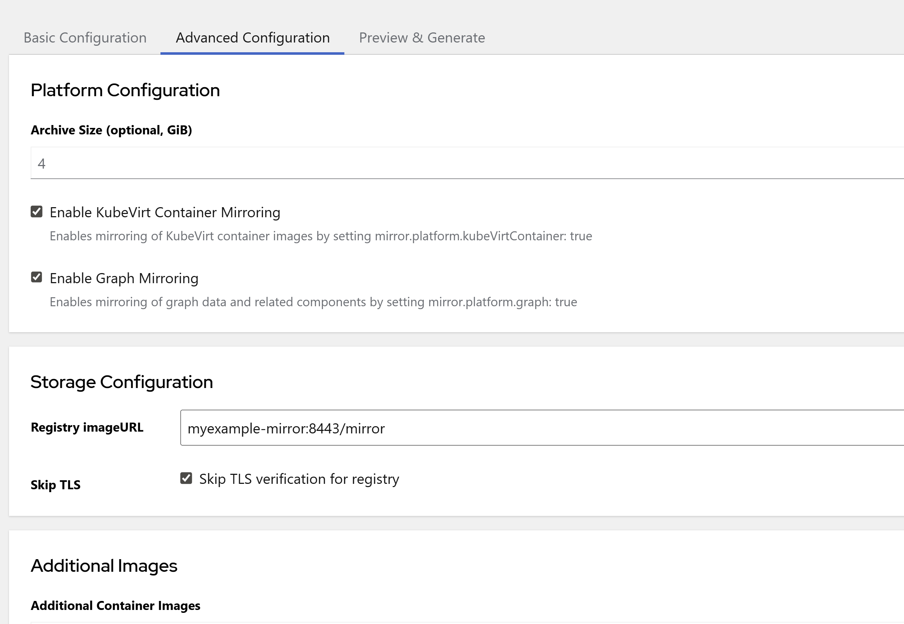
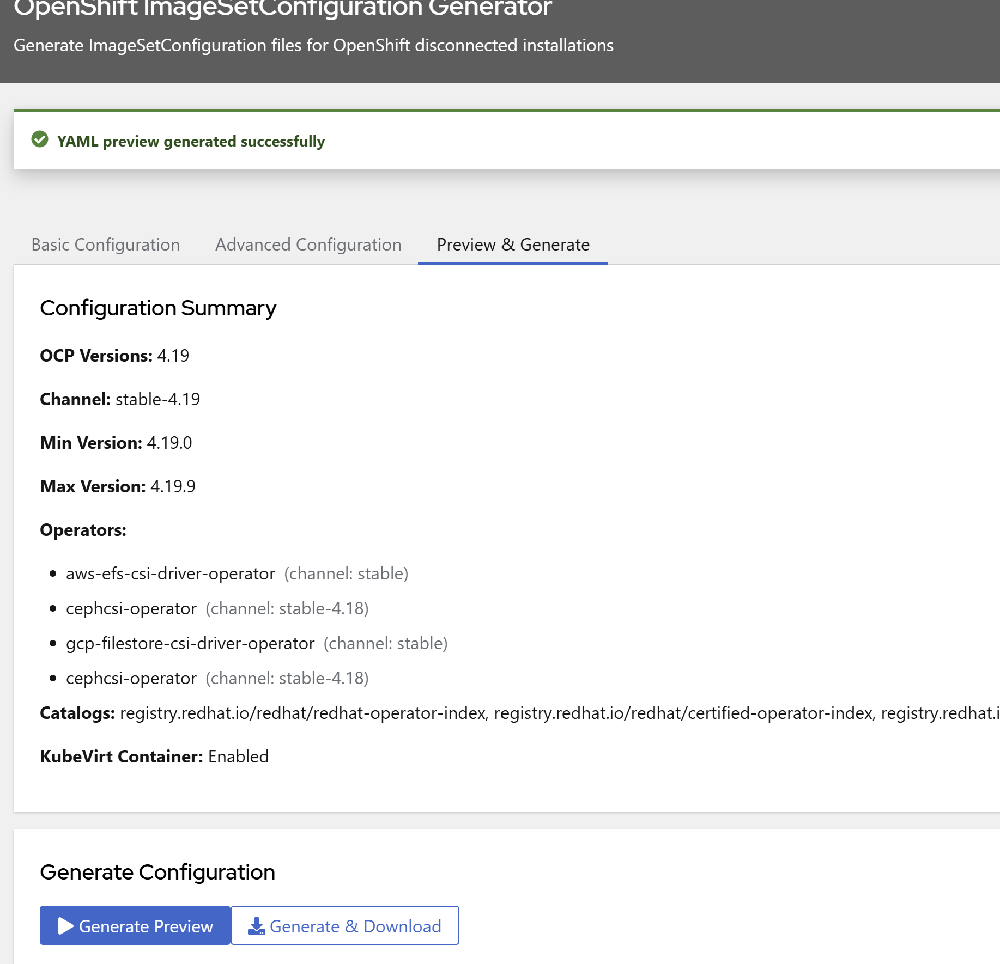

# OpenShift ImageSetConfiguration Generator

[](https://github.com/tomazb/imageset-generator/actions/workflows/test.yml)
[](https://github.com/tomazb/imageset-generator/actions/workflows/security.yml)
[](https://github.com/tomazb/imageset-generator/actions/workflows/container.yml)
[](https://github.com/tomazb/imageset-generator/actions/workflows/quality.yml)

This tool generates ImageSetConfiguration files for OpenShift disconnected installations using the oc-mirror tool. It takes OCP versions and operator suggestions as input and creates a YAML configuration that can be used to mirror container images and operators for air-gapped environments.  
The data used by the tool is stored in the data subfolder.To have it refreshed run rm -rf ./data/*.

## Features

- **Web-based UI** - User-friendly React frontend for configuration
- **Multi-version Support** - Generate configs for OCP 4.16 through 4.20
- **Operator Search** - Search and filter operators by name or keywords
- **Multi-catalog Support** - Red Hat, Certified, Community, and Marketplace catalogs
- **Security Features**
  - Input validation with allowlist patterns
  - Path traversal prevention
  - Configurable TLS verification (secure by default)
- **Code Quality**
  - Comprehensive test coverage (27 tests)
  - Custom exception classes with detailed context
  - Centralized configuration management
  - Refactored for maintainability

## Quick Start

1 Build the application container Image with Podman and run the application 
  ```bash
  ./start-podman.sh
  ```

  Script should output web location 
  

2 Open Application WebPage

- Select the OCP Version you want to mirror, the channel and the min and max versions.



- Select which OpenShift Catalogs you want to search operators from



- Search for the Operators you want based on Name or Keywords.


- On the Advanced configuration tab, fill in the storage configuration and available checkboxes.



- On the Preview & Generate tab select "Generate Preview" to obtain the output imageset configuration.Copy you output configuration using the copy to clipboard.



## Architecture

### Backend (Flask/Python)

- **`app.py`** - Main Flask application with REST API endpoints
- **`validation.py`** - Input validation with allowlist patterns
- **`constants.py`** - Centralized configuration (timeouts, catalogs, patterns)
- **`exceptions.py`** - Custom exception classes with detailed context
- **`generator.py`** - ImageSet YAML generation logic

### Frontend (React)

- **`frontend/src/App.js`** - Main React application
- **`frontend/src/components/`** - React components for UI

### Data Storage

- **`data/`** - Cached operator and catalog information
  - Operator indexes per catalog and version
  - OCP version and channel data
  - Auto-refreshed on first access

## Security Features

### Input Validation (`validation.py`)

All user inputs are validated using allowlist patterns:

```python
from validation import validate_catalog_url, validate_version, ValidationError

# Catalog URLs must match Red Hat registry patterns
validate_catalog_url("registry.redhat.io/redhat/redhat-operator-index")

# Versions must be in X.Y format
validate_version("4.18")

# Channels validated against known patterns
validate_channel("stable-4.18")

# Path components checked for traversal attempts
safe_path_component("operators-redhat-4.18.json")
```

### TLS Configuration (`constants.py`)

TLS verification is configurable and secure by default:

```python
from constants import TLS_VERIFY
from app import build_opm_command

# TLS_VERIFY = True by default (secure)
cmd = build_opm_command(catalog_url)  # No --skip-tls flag

# Override if needed (not recommended for production)
cmd = build_opm_command(catalog_url, skip_tls=True)
```

### Path Traversal Prevention

All file paths are sanitized to prevent directory traversal:

```python
from validation import safe_path_component

# Blocks: ../../../etc/passwd, /absolute/path, etc.
safe_component = safe_path_component("operators-data.json")  # OK
```

## Configuration

### Constants (`constants.py`)

Centralized configuration for all timeout values, patterns, and catalogs:

```python
# Timeouts (seconds)
TIMEOUT_OC_MIRROR_SHORT = 30
TIMEOUT_OC_MIRROR_MEDIUM = 120
TIMEOUT_OC_MIRROR_LONG = 180
TIMEOUT_OPM_RENDER = 180
TIMEOUT_CATALOG_DISCOVERY = 300

# Application settings
DEFAULT_HOST = '0.0.0.0'
DEFAULT_PORT = 5000

# Security
TLS_VERIFY = True  # Secure by default

# Validation patterns
VERSION_PATTERN = r'^\d+\.\d+$'
CHANNEL_PATTERN = r'^[a-zA-Z0-9\-\.]+$'

# Supported catalogs
BASE_CATALOGS = [
    'registry.redhat.io/redhat/redhat-operator-index',
    'registry.redhat.io/redhat/certified-operator-index',
    'registry.redhat.io/redhat/community-operator-index',
    'registry.redhat.io/redhat/redhat-marketplace-index'
]
```

## Error Handling

### Custom Exceptions (`exceptions.py`)

Domain-specific exceptions with detailed context:

```python
from exceptions import CatalogRenderError, OperatorNotFoundError

try:
    render_catalog(catalog_url)
except CatalogRenderError as e:
    # Includes catalog, version, and original error
    print(f"Error: {e}")
    print(f"Details: {e.details}")
    print(f"Caused by: {e.original_error}")
```

Available exception classes:
- **`ImageSetGeneratorError`** - Base exception with context preservation
- **`CatalogError`**, **`CatalogRenderError`**, **`CatalogParseError`** - Catalog operations
- **`OperatorError`**, **`OperatorNotFoundError`**, **`InvalidChannelError`** - Operator operations
- **`VersionError`**, **`InvalidVersionError`**, **`VersionComparisonError`** - Version operations
- **`ConfigurationError`** - Configuration issues
- **`FileOperationError`** - File operations
- **`NetworkError`** - Network issues
- **`GenerationError`** - ImageSet generation failures

## Testing

Run the comprehensive test suite:

```bash
# All tests
python3 test_validation_simple.py   # Input validation (4 tests)
python3 test_constants.py           # Constants structure (2 tests)
python3 test_tls_config.py          # TLS configuration (5 tests)
python3 test_refactoring.py         # Refactored functions (6 tests)
python3 test_exceptions.py          # Exception classes (10 tests)

# Quick test all
for test in test_*.py; do python3 "$test"; done
```

**Total: 27 tests, all passing** ✓

## Development

### Code Quality Standards

- **Single Responsibility Principle** - Each function has one clear purpose
- **Input Validation** - All user inputs validated with allowlist patterns
- **Error Context** - Custom exceptions with detailed diagnostic information
- **Test Coverage** - Comprehensive tests for all new functionality
- **No Magic Numbers** - All constants defined in `constants.py`
- **Secure by Default** - TLS verification enabled, input validation required

### Recent Improvements (October 2025)

- ✅ Input validation module with allowlist patterns
- ✅ Constants extraction (removed all magic numbers)
- ✅ Configurable TLS verification (secure by default)
- ✅ Path traversal prevention
- ✅ Custom exception classes with context
- ✅ Function refactoring (73% size reduction)
- ✅ Comprehensive test coverage (27 tests)

See [CHANGELOG.md](CHANGELOG.md) for detailed change history.

## Contributing

When contributing, please ensure:

1. All new code includes comprehensive tests
2. Input validation for any user-provided data
3. Use constants from `constants.py` (no magic numbers)
4. Use custom exceptions from `exceptions.py` with context
5. Follow Single Responsibility Principle for functions
6. Update documentation and CHANGELOG

## License

See LICENSE file for details.

## Additional Documentation

- [CHANGELOG.md](CHANGELOG.md) - Detailed change history
- [CODE-SMELL-ANALYSIS-RESOLUTION.md](CODE-SMELL-ANALYSIS-RESOLUTION.md) - Security audit and improvements
- [CI_DOCUMENTATION.md](CI_DOCUMENTATION.md) - CI/CD pipeline documentation

## CI/CD Pipeline

The project uses GitHub Actions for automated testing, security scanning, and container builds:

- **Python Tests** - 27 tests across Python 3.10-3.13
- **Security Scans** - Bandit, Safety, CodeQL, Trivy (weekly + on PR)
- **Container Builds** - Docker/Podman builds with vulnerability scanning
- **Code Quality** - Linting, complexity checks, type checking
- **Dependency Updates** - Automated Dependabot updates

Container images published to: `ghcr.io/tomazb/imageset-generator`

See [CI_DOCUMENTATION.md](CI_DOCUMENTATION.md) for detailed pipeline information.
